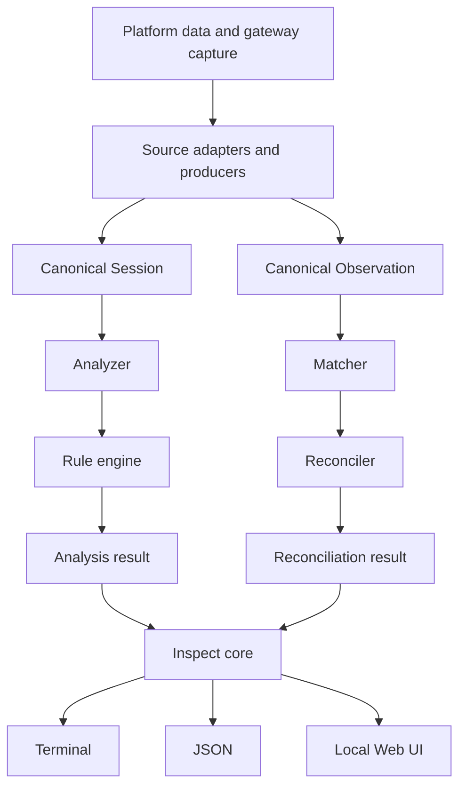
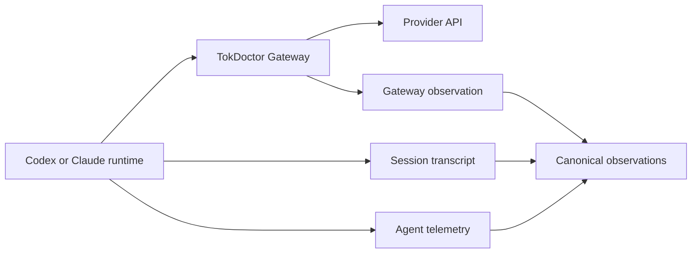
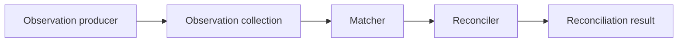
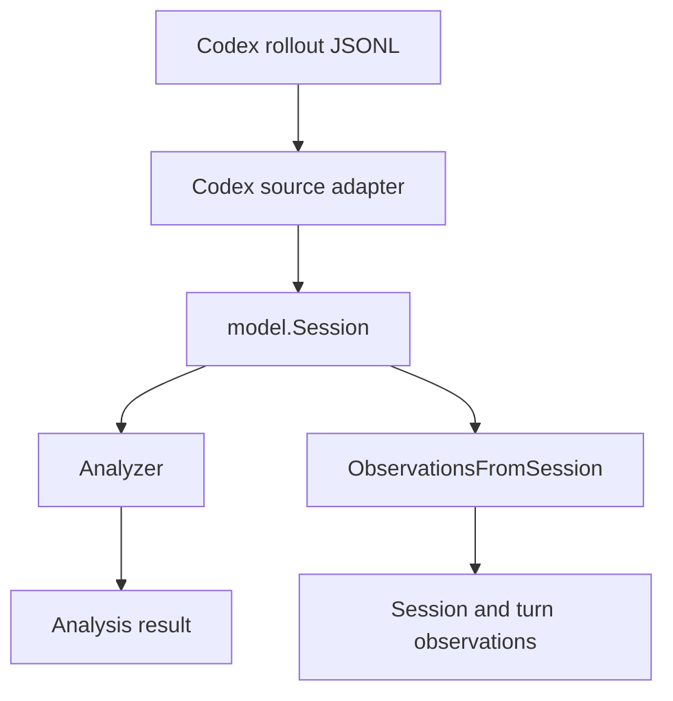
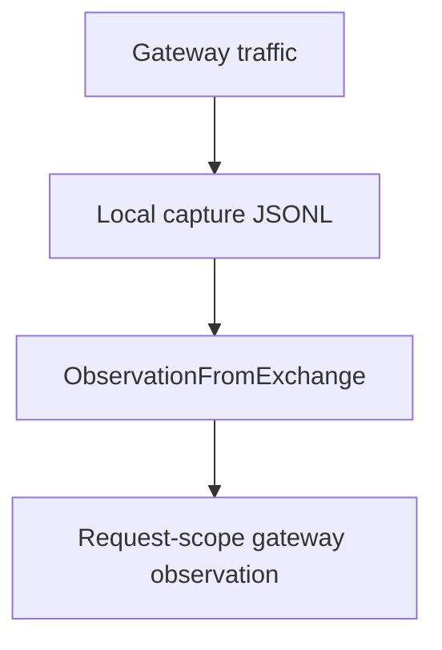
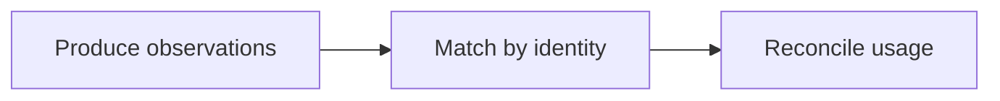
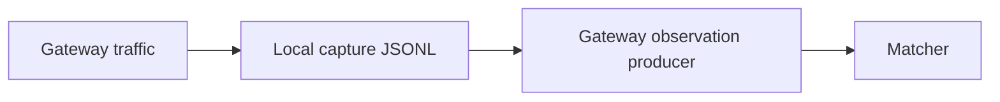

# Architecture

TokDoctor is a local-first token profiler and context optimizer for AI coding agents.

One requirement shapes the whole design:

> Platform-specific data collection must be isolated from platform-independent analysis.

TokDoctor ships as a single binary, prefers the standard library, and keeps platform parsing at the edge. Components below are labeled `Current`, `Planned`, or `Future`. `Current` means code exists today; a qualifier such as `partial` or `incomplete` marks a component that works but does not yet do everything described for it. `Planned` means the direction is agreed but the code does not exist yet. `Future` is outside current scope.

When this document and the code disagree, the code and its tests are the source of truth.

Product phases, priorities, and completion criteria live in the
[roadmap](roadmap.md). This document describes architecture rather than owning a
second roadmap.

## Goals and Non-Goals

Goals:

- local-first analysis with no account and no cloud dependency
- single-binary distribution
- streaming access to large session files
- multiple AI coding-agent sources
- deterministic token and context diagnostics
- terminal, JSON, and optional local Web UI output
- future community-built adapters

Non-goals:

- framework-heavy layering
- Java-style service/repository abstractions
- platform-specific logic in core analysis
- duplicated analysis logic across CLI and Web UI
- cloud infrastructure for local features
- abstractions added before a real use case needs them

## High-Level Architecture

Two canonical pipelines converge at the inspect core. The session pipeline produces an analysis result. The observation pipeline produces a reconciliation result. Both feed one inspection result that presentation layers render.



Both pipelines are implemented and reachable from the CLI, but through different commands.

`tok doctor` runs the session pipeline: it normalizes a session and renders an analysis result with findings.

`tok inspect <session-id>` runs the observation pipeline: it resolves the session, projects its transcript observations, gathers gateway observations for the session's time window, matches them, and reports reconciliation. When gateway capture is unavailable, it says so instead of reporting an empty result.

Neither command does both. `tok inspect` runs no diagnostic rule, and `tok doctor` does not reconcile. No result type yet carries an analysis result and a reconciliation result together; that is what the inspect core is meant to become.

There is no separate observation catalog component. Observations are produced on demand and passed directly to the matcher; nothing persists them or queries them by source, channel, scope, or time.

## Platform Sources and Observation Channels

### Platform sources

| Source | Kind | Current state |
| --- | --- | --- |
| Codex | local session files | session and turn normalization; session transcript observation producer |
| Claude Code | local session files | session and turn normalization; session transcript observation producer |
| 9Router | local endpoint | detection and endpoint probe only |
| TokDoctor Gateway | local HTTP capture | request capture; gateway observation producer |

Additional sources are added based on real community demand.

### Observation channels

A **channel** describes how data was observed, not what it represents. There are three channels, defined by the canonical contract:

| Channel | Meaning |
| --- | --- |
| `gateway` | the gateway observed the HTTP request/response directly |
| `agent_telemetry` | a coding agent runtime recorded the event or request telemetry |
| `session_transcript` | the record was reconstructed from a persisted session log |

A **scope** describes what level an observation represents: `request`, `turn`, or `session`.

Channel and scope are independent. An adapter does not have to produce all channels. A workflow may collect one, two, or three channels depending on what the data actually provides. A missing channel is reported as unavailable with a reason, never fabricated and never converted into an explicit zero. `tok coverage` does not report channel presence; it measures tool output observability.

### Ideal request path



The runtime produces agent telemetry and a session transcript. The gateway produces a gateway observation. All three are independent observations of the same activity.

Only two of the three are implemented today: the gateway request and the session transcript turn, which `tok inspect` matches and reconciles. Agent telemetry has no producer, so a session recorded only through telemetry has no TokDoctor observation.

## Dependency Direction

Platform-specific details stay at the edge. The important rule is not the exact package diagram.

Forbidden dependencies:

```text
model      -> codex or claude or router9
rule       -> platform parser
rule       -> presentation
analyze    -> terminal renderer
matcher    -> raw capture files
reconciler -> raw capture files
web UI     -> raw source files
```

Core analysis, matching, and reconciliation operate on canonical data only.

## Main Components

### 1. Source Adapters and Producers

A source adapter owns platform-specific data access and normalization. A **producer** is a platform-specific projection from normalized or raw source data into `model.Observation`.

An adapter or producer may:

- detect whether a source exists
- discover sessions or usage records
- stream and read raw data
- parse platform-specific formats
- normalize into canonical `model.Session`
- project data into canonical `model.Observation`
- preserve provenance and provider-reported usage

An adapter or producer must not:

- match observations across sources
- decide cross-source authority
- reconcile token differences
- run generic diagnostic rules
- render terminal or Web UI output

Current producers:

| Producer | Input | Output |
| --- | --- | --- |
| `gateway.ObservationFromExchange` | gateway exchange record | request-scope `gateway` observation |
| `codex.ObservationsFromSession` | canonical codex session | session-scope and turn-scope `session_transcript` observations |
| `claude.ObservationsFromSession` | canonical claude session | session-scope and turn-scope `session_transcript` observations |

All three are implemented and tested, and the inspect core calls them: `tok inspect` projects transcript observations for a Codex or Claude session and reads gateway observations from local capture before matching and reconciling them.

9Router has no observation producer. The `agent_telemetry` channel is defined in the canonical contract but no producer emits it yet.

Do not create one large interface that every adapter must implement for every capability. Keep interfaces small and define them near the consumer. The adapter contract is described further in [`adapter-spec.md`](adapter-spec.md).

### 2. Canonical Model

The canonical model is the platform-independent representation of agent activity. It is the most important architectural boundary in TokDoctor. Concepts:

| Concept | Role |
| --- | --- |
| `Session` | agent activity container used by the analyzer |
| `Turn` | per-turn slice of a session |
| `Invocation` | a model invocation within a session |
| `ContextComponent` | attributed piece of request context |
| `ContextAttribution` | per-turn composition of context components |
| `ContextReconciliation` | per-turn check that accounted input matches authoritative usage |
| `Usage` | token usage block |
| `Measurement` | a value plus its measurement kind |
| `Observation` | one measurement from one channel and scope |
| `ObservationIdentity` | correlation identity for an observation |
| `Finding` | diagnostic produced by a rule |
| `Evidence` | audit-safe reference to the origin of a value |
| `FindingEvidence` | audit-safe description of the observed item behind a finding |

Key rules:

- `Session` serves agent-activity analysis. `Observation` is one measurement from one channel and one scope.
- An observation ID is a record identifier, not a correlation ID.
- Correlation identity lives in `ObservationIdentity`, and each field is its own namespace.
- Identity is never invented from a timestamp, model name, or token total.
- `model.Finding` carries `RuleID`, `Name`, `Severity`, `Confidence`, `Title`, `Description`, an estimated-token `Measurement`, `FindingEvidence`, and a recommendation. Only the severity and confidence values that a shipped rule actually emits are defined today: `SeverityMedium`, `SeverityHigh`, and `ConfidenceHigh`.
- `model.FindingEvidence` describes the observed item — turn, tool call, output bytes, completeness — without exposing tool output content, hashes, paths, prompts, or raw source records.

The canonical model must not contain source-specific record types. The normative, field-level observation contract is [`reconciliation-observation.md`](reconciliation-observation.md); this document does not restate it.

### 3. Observation Collection (Current, inline)

There is no observation catalog package. The application layer gathers observations for one inspection: it calls the transcript producer for the session's source, reads gateway capture for the profiles bound to that source, keeps only exchanges inside the session's time window, and passes the combined slice to the matcher.

Nothing is persisted, indexed, or queried by source, channel, scope, or time. Each inspection re-reads the sources it needs. A catalog that filters and caches observations across sessions does not exist; when it does, it must not match or reconcile on its own.

### 4. Matcher (Current)

The matcher groups observations that describe the same underlying activity. It lives in `internal/match`, compares only gateway request observations against session transcript turn observations, prefers explicit identity, and falls back to a time window (`match.DefaultTimeWindow`, two minutes) combined with model compatibility and usage similarity. Each side records its own best preference, and a match is reported only when both sides choose each other; otherwise the result is `ambiguous` or `unmatched`. A gateway observation that matches nothing is still reported. The matcher never decides authority.

Matching logic does not live in `internal/model`. Session-scope transcript observations are produced but not matched, because there is no request-level counterpart to compare them against.

### 5. Reconciler (Current)

The reconciler lives in `internal/reconcile` and compares only observations already matched by the matcher. It rejects a pair that is not `matched`, that carries candidate IDs, that puts the same observation on both sides, or whose sides are not a gateway request and a transcript turn. Missing values stay missing and are reported as unavailable rather than as zero. It compares seven usage fields — fresh input, cached input, cache-creation input, total input, output, reasoning output, and total — and reports per-field deltas plus an overall status of `equal`, `different`, or `unavailable`.

`reconcile.BuildReport` wraps matching and reconciliation into one report with a summary of gateway requests, transcript turns, matched, equal, different, unavailable, ambiguous, and unmatched counts. Dependency lineage between observations is not yet tracked, so two observations of the same underlying record are not detected as dependent.



### 6. Analyzer (Current)

The analyzer orchestrates platform-independent session analysis. It receives one normalized session, runs every rule it holds against that session, collects the findings, and produces an `analyze.Result` with the session, the findings, and a summary status of `healthy` or `findings`. It does not read platform files, parse source payloads, mutate session data, or render output.

Rules receive the canonical `model.Session` directly. There is no intermediate derived analysis context yet.

The analyzer is the session pipeline. It is not the reconciliation pipeline.

### 7. Rule Engine (Current)

Rules detect token and context problems from canonical data. The analyzer holds an explicit rule list and runs every rule it holds.

Two diagnostic rules are implemented and enabled by default:

| Rule | Name | Detects |
| --- | --- | --- |
| `TOOL001` | `oversized-tool-output` | a complete tool result above 64 KiB in a turn's context attribution |
| `TOOL002` | `repeated-tool-call` | a tool that appears to have been called more than once with the same arguments and the same complete result content |

`TOOL001` reports byte size as observed from the transcript. Its token contribution stays an estimate and is reported as such; the rule never presents it as provider-reported usage. It skips truncated or unavailable tool results, because only a complete result has a trustworthy size.

`TOOL002` matches on the tool name, a tool call fingerprint, and the result content hash together, and only when the source declared a distinct non-empty tool call ID for each occurrence. Adapters build the fingerprint from the arguments the source declared for a call and attach it to the linked result; the rule never parses source formats and never sees raw arguments. Because a repeat can be legitimate, the finding says the tool *appears* to have been called repeatedly and reports only the repeats after the first as an estimated token impact. The fingerprint is internal and is never serialized, rendered, or logged.

A fingerprint belongs to one of two domains. Structured arguments use canonical JSON fingerprints (`v1:`), which order object keys deterministically and preserve array order. Freeform tool input uses exact-text fingerprints (`v1-text:`), which hash the declared input byte for byte without parsing it as JSON. The domains carry the marker inside the hashed payload as well as in the prefix, so a structured call and a freeform call can never collide, even when their visible characters match. An adapter picks the domain from the meaning its own format gives a field: Codex reads `arguments` on a `function_call` as structured JSON, and reads a string `input` on a `custom_tool_call` as freeform text while an inlined object or array still goes through the structured path. V1 performs no semantic normalization of commands, paths, patches, or JavaScript source.

The remaining rule families are specified in [`rule-spec.md`](rule-spec.md) and are not implemented:

```text
MCP001   unused-mcp
MCP002   oversized-mcp-schema

TOOL003  repeated-file-read

CTX001   runaway-context-growth

INST001  oversized-instructions
```

Rules must be deterministic by default. A rule detects one clear problem, returns evidence, reports severity and confidence, estimates or measures token impact, and provides an actionable recommendation.

Rules must not:

- read raw platform data
- contain presentation logic
- mutate source data
- present estimates as provider measurements

Reconciliation is not a rule, and an `Observation` is not forced into a `Session`.

### 8. Inspect Core (Current, partial)

`inspect` is the application use case behind session inspection, not just a CLI renderer. `app.InspectReport` resolves one session and returns:

- the canonical session, with usage, turns, context attribution, and evidence
- per-turn context reconciliation (`model.ReconcileContext`)
- the reconciliation report, when gateway capture for the session's source is available
- per-turn reconciliation status (`matched`, `ambiguous`, `unmatched`)
- an unavailable reason when reconciliation cannot run

It does not yet return an analysis result: `inspect` and `doctor` remain separate use cases, and no result type carries both. It also does not select a turn or a request as a first-class entity — the CLI filters turns at render time, and requests are reached only through the matched gateway observation.

Interactive selection belongs to the CLI or presentation layer. Discovery, lookup, matching, and reconciliation belong to the application and core.

### 9. Presentation (Current)

Presentation layers are terminal, JSON, and the local Web UI. They may format, group, sort, and serialize results. They must not calculate waste, parse session files, execute source logic, perform matching or reconciliation, or redefine rule behavior.

For `tok doctor` all three render the same `analyze.Result`: `report/terminal`, `report/json`, and the Web UI's `/api/result`. Other commands have their own result types and either one or two renderers. The local Web UI binds to `127.0.0.1` by default and stays usable only as a presentation layer.

## Token Accuracy Model

Two independent axes must not be conflated.

### Measurement kind (value provenance)

Defined by `model.MeasurementKind`:

| Kind | Meaning |
| --- | --- |
| `measured` | reported directly by a provider or authoritative source |
| `derived` | computed deterministically from data that has provenance |
| `counted` | counted directly from local records |
| `estimated` | inferred, with meaningful uncertainty |
| `unknown` | not enough data to classify |

A `derived` measurement may be trustworthy, but it is never called provider-measured. A missing value has a nil value; an explicit zero is a measured value of zero.

### Confidence (finding and inference)

Confidence describes how certain TokDoctor is about a diagnosis, independently of how a value was produced. [`rule-spec.md`](rule-spec.md) defines `high`, `medium`, and `low` for rules.

`model.Confidence` currently defines only `high`, the value both implemented rules report, because they act on directly observed transcript data: a byte size above a threshold, and a repeated call the source itself declared with distinct call IDs and identical arguments and result content. The matcher uses its own confidence scale (`high` for shared identity, `medium` for a heuristic match).

Provider-reported usage takes precedence over local estimation. TokDoctor must never present estimated attribution as exact provider usage.

## Data Flow Examples

### Codex

The Codex adapter serves both pipelines: analysis through `model.Session`, and observation projection through `ObservationsFromSession`.



### Claude Code

Claude follows the same shape as Codex: `tok doctor` and `tok inspect` read `model.Session` through the Claude adapter, and `claude.ObservationsFromSession` projects session-scope and turn-scope transcript observations for reconciliation.

### TokDoctor Gateway

The gateway records request metadata to a local append-only capture, then a producer projects a request-scope observation.



### 9Router

Current code detects and probes the 9Router endpoint only. It does not produce a canonical session, telemetry, or an observation. Any future output depends on verified 9Router capabilities and must not be assumed. Do not claim that 9Router always produces `model.Session`.

## Correlation: Produce, Match, Reconcile

Correlation is implemented: the matcher and reconciler run inside `tok inspect`. Two observations must be matched before they are compared, and neither side is treated as authoritative.



Required invariants:

- an observation ID is not a correlation identity
- identity fields are never copied between namespaces
- explicit identity is stronger than temporal proximity
- a request-scope observation is never compared directly to a session-scope aggregate
- an unmatched observation is still valid
- a missing channel is reported as unavailable with a reason, never invented and never converted to zero
- observations with dependent lineage are not independent cross-confirmation

Most of these hold today. Identity fields are separate typed fields compared only against the same field, so they cannot be copied between namespaces. The matcher tries identity before heuristics. An unmatched observation is still returned and still reported. The reconciler rejects any pair that is not a gateway request against a transcript turn, and it leaves a missing value unavailable instead of turning it into zero. Missing gateway capture is reported as unavailable with a reason.

Dependent lineage is the exception: it is specified but not detected, so two observations of the same underlying source record would currently be reconciled as if each confirmed the other.

## Streaming and Large Files

Session files may become very large. Source adapters should stream JSONL and similar formats whenever practical, using a buffered reader and a record parser over the file. Avoid loading whole files into memory unless the format requires it or the size is known to be safe. Optimize only after measurement.

Memory grows with one record, not with the file. There is no fixed per-record ceiling that fails a session: a record above the safety valve is skipped and reported as unreadable context, and parsing continues. A malformed record that only affects context coverage becomes an unreadable context component with provenance and no measurement, so incomplete coverage is visible without corrupting reconciliation.

The same rule applies to capture limits, which bound observation only:

```text
request above the capture limit -> forwarded upstream byte for byte, observation marked truncated
response above the capture limit -> forwarded downstream byte for byte, observation marked truncated
observer unavailable             -> body forwarded unchanged, observation marked unavailable
```

A capture limit never rejects a request, never alters a forwarded body, and never buffers a large body in full. Capture state is recorded per exchange, and context derived from a truncated body is not parsed, because a partial JSON prefix would invent components and provider usage the client never sent.

## Storage

No database is required for current analysis.

`Current`: the gateway maintains a local append-only capture as JSONL. The capture stores normalized request metadata and content hashes rather than raw request or response bodies.



Storage rules:

- capture storage is not the canonical model
- the matcher and reconciler do not read raw capture directly; they consume canonical observations
- agent session files remain read-only during analysis
- purging capture is an explicit user action (`tok gateway remove --purge`)
- nothing is uploaded: no prompts, source code, responses, or session history

`Future`: a local database (for example SQLite) may be introduced for history, comparison, regression detection, or before/after verification. Analysis, matching, and reconciliation must not depend on it.

## Security Boundaries

By default TokDoctor must:

- operate locally
- require no account and no cloud service
- avoid uploading prompts, source code, tool output, or session history
- avoid telemetry unless explicitly enabled
- bind the Web UI and gateway to loopback only
- never modify original agent session data during analysis
- never log secrets, credentials, API keys, or tokens

Security-sensitive changes should be reviewed against [`SECURITY.md`](../SECURITY.md).

## Testing Strategy

Architecture boundaries are protected by tests. This section states the strategy and invariants, not a full test specification.

### Source adapter tests (Current)

Fixture-based tests cover detection, session discovery, parsing, normalization, unknown events, malformed required records, and relevant edge cases. Fixtures must be synthetic or sanitized.

### Producer tests (Current, incomplete)

Producer tests cover valid projection, missing versus explicit zero, outcome and completeness, deterministic behavior, privacy, and malformed input. They do not yet cover dependent lineage, because the model does not track it.

### Matcher tests (Current)

Matcher tests cover exact identity, conflicting identity, ambiguous matches, weak temporal matches, unmatched observations, and deterministic ordering.

### Reconciler tests (Current, incomplete)

Reconciler tests cover missing versus explicit zero, measured versus derived values, field deltas, incompatible scopes, and per-field status. They do not cover dependent lineage, which the model does not track.

### Rule and integration tests (Current)

Each rule has a positive case, a negative case, and edge cases. Integration tests cover source, normalize, analyze, and findings. Stable terminal output may use golden tests. Avoid excessive mocking.

## Package Structure

Current organization:

```text
tokdoctor/
├── cmd/tok/main.go
├── internal/
│   ├── analyze/          analysis orchestration and the rule list
│   ├── app/              use cases; owns observation collection
│   ├── cli/              cobra commands and input selection
│   ├── config/           configuration
│   ├── coverage/         tool output observability metrics
│   ├── gateway/          capture, proxies, chains, observations
│   ├── match/            observation matching
│   ├── model/            canonical model, no platform types
│   ├── pricing/          catalog, cost estimation
│   ├── reconcile/        field comparison and reconciliation report
│   ├── report/           presentation
│   │   ├── cost/
│   │   ├── coverage/
│   │   ├── inspect/
│   │   ├── json/
│   │   ├── pricing/
│   │   ├── sessions/
│   │   ├── source/
│   │   ├── terminal/
│   │   └── usage/
│   ├── rule/
│   │   └── tool/         TOOL001, TOOL002
│   ├── source/
│   │   ├── catalog/      detector registry, not an observation catalog
│   │   ├── claude/
│   │   ├── codex/
│   │   └── router9/
│   └── webui/            HTTP handler and embedded static assets
├── ui/
├── fixtures/
└── docs/
```

Matcher and reconciler logic live in `internal/match` and `internal/reconcile`. They must not live in `internal/model`. Do not create packages purely to match a diagram; a package should own meaningful behavior. `internal/source/catalog` is a registry of source detectors; it is unrelated to the observation catalog described above.

## Go Design Principles

- Standard library first.
- Small interfaces, defined near their consumer. Introduce an interface only for a real boundary or multiple implementations.
- Concrete types by default. No service/implementation pairs, no DI containers, no factories for trivial construction.
- Explicit dependency injection through constructors and wiring.
- Clear package ownership. Avoid generic packages such as `utils`, `common`, `helpers`, `base`, or `impl`.
- Errors carry context and support `errors.Is` and `errors.As`.
- Comments explain non-obvious intent, constraints, or protocol quirks, not obvious code.
- Use `context.Context` only for cancellation, deadlines, and request lifecycle.

## CLI and Web UI

TokDoctor is CLI-first. Current commands include:

```bash
tok version
tok doctor [session-id] [--format terminal|json] [--ui]
tok ui
tok usage --source <name> | --all [--format terminal|json]
tok sessions [--source <name>] [--format terminal|json]
tok inspect [session-id] [--turn <n>] [--all-turns] [--context] [--evidence] [--format terminal|json]
tok coverage tool-output [session-id] | --source <name> | --all [--format terminal|json]
tok cost [session-id] | --all | --provider <name> [--format terminal|json]
tok pricing status|update|list|show|missing|add
tok sources
tok source show|set|reset|test <name>
tok gateway start|status|stop|setup|remove|requests|inspect|chains|chain|report
```

`tok inspect` and `tok doctor` behave differently when no session ID is given. `tok inspect` lists sessions and prompts for one. `tok doctor` analyzes a placeholder Codex session rather than discovering the latest one, so it reports no findings.

`tok gateway requests` and `tok gateway inspect` are transitional surfaces. They are not declared deprecated and have no scheduled removal.

### Planned inspect direction

`inspect` should become the unified entry point for session analysis and observation reconciliation.

Interactive direction:

```text
select session
  -> select turn
  -> select request
  -> inspect observations and reconciliation
```

Non-interactive direction for automation:

```bash
tok inspect --session <id>
tok inspect --session <id> --turn <id>
tok inspect --request <id>
tok inspect --format json
```

This is the `Planned` direction. Current `tok inspect` accepts a positional session ID only and does not support `--session`, `--turn`, or `--request`. Reconciliation already runs inside `tok inspect`; what remains is unifying it with the analysis result and addressing a turn or a request directly.

### Web UI

The Web UI is an optional local presentation layer. It reads the `tok doctor` analysis result from `/api/result` and renders it; it must not duplicate analysis logic. Other commands have no Web UI view, so inspection and reconciliation are terminal and JSON only. The UI is embedded into the Go binary with `//go:embed` to preserve single-binary distribution. `tok ui` and `tok doctor --ui` compute one analysis result and serve it from `/api/result` for the lifetime of the process.

When the API cannot be read, the UI reports that the result is unavailable. It never substitutes a placeholder analysis result, and it never assumes a source.

## Initial Vertical Slice

The first vertical slice (`Completed`) was intentionally small:

```text
Codex session discovery
        |
        v
stream latest JSONL session
        |
        v
extract authoritative usage
        |
        v
normalize relevant events
        |
        v
detect largest tool outputs
        |
        v
run first deterministic rule
        |
        v
render terminal report
```

This history is kept for context.

## Current Architecture Scope

`Current`:

- Codex and Claude source adapters: discovery, session and turn normalization, authoritative usage
- canonical session and observation models
- analyzer with two implemented rules, `TOOL001 oversized-tool-output` and `TOOL002 repeated-tool-call`
- per-turn context attribution and context reconciliation
- observation producers for Codex, Claude, and the gateway
- matcher and reconciler, reachable through `tok inspect`
- tool output coverage measurement
- pricing catalog and API-equivalent cost estimation
- gateway capture, profiles, chains, and profile accounting
- terminal, JSON, and local Web UI presentation

Partial or missing:

- `tok inspect` reconciles but does not return an analysis result, and `tok doctor` analyzes but does not reconcile
- `tok doctor` without a session ID analyzes a placeholder session instead of discovering one
- two diagnostic rules are implemented (`TOOL001`, `TOOL002`); the rest of the rule families in [`rule-spec.md`](rule-spec.md) are unimplemented
- 9Router is detection and endpoint probe only
- no agent telemetry producer
- no dependent-lineage tracking between observations
- no observation catalog, persistence, or history

Do not build all adapters, persistent storage, auto-fix, cloud features, or historical comparison before the core proves useful.

## Architecture Invariants

1. Core analysis is platform-independent.
2. Source adapters and producers own platform-specific parsing and projection.
3. Presentation contains no analysis, matching, or reconciliation logic.
4. Rules consume canonical session data only.
5. Provider measurements, derived values, counted values, and estimates remain distinguishable.
6. Missing values are never converted to zero, and unknown is never converted to measured.
7. Local-first is the default.
8. Source data is read-only during analysis.
9. Capture storage is not the canonical model.
10. An observation ID is not a correlation identity.
11. Interfaces stay small and purposeful.
12. Dependencies remain minimal, and simple code is preferred over architectural ceremony.
13. Observation limits never change what is forwarded, and captured data always reports how complete it is.
