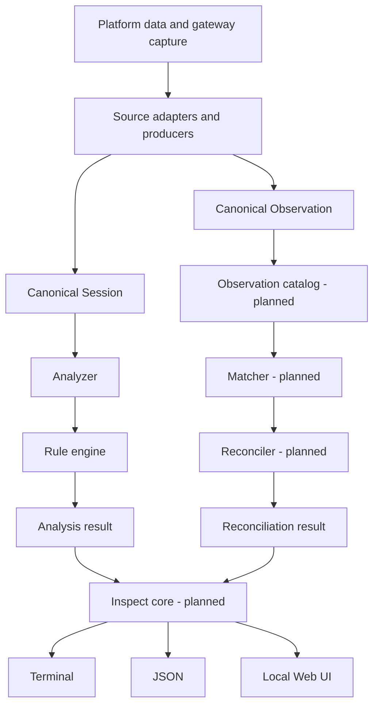
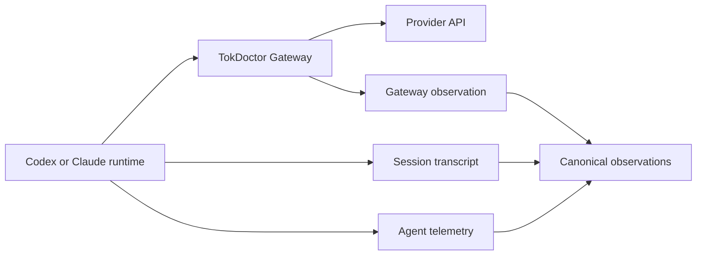
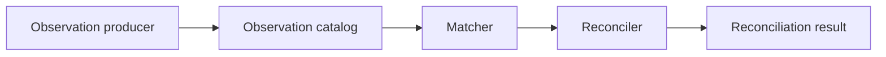
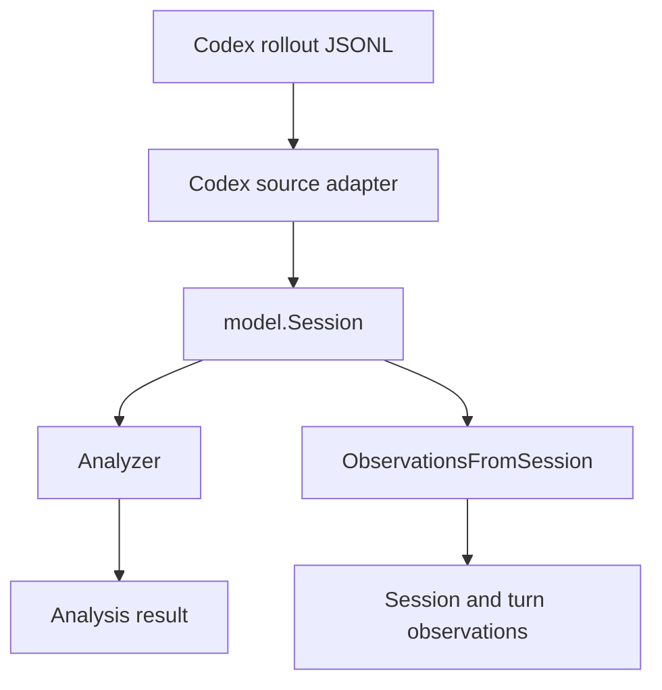
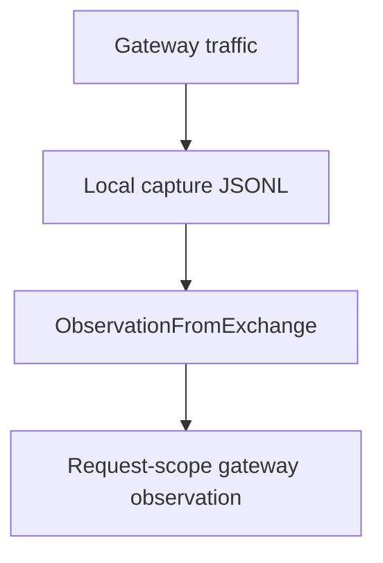
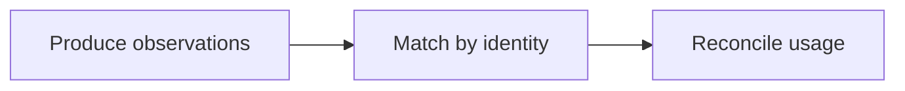
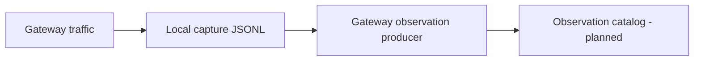

# Architecture

TokDoctor is a local-first token profiler and context optimizer for AI coding agents.

One requirement shapes the whole design:

> Platform-specific data collection must be isolated from platform-independent analysis.

TokDoctor ships as a single binary, prefers the standard library, and keeps platform parsing at the edge. Components below are labeled `Current`, `Planned`, or `Future`. `Current` means code exists today. `Planned` means the direction is agreed but the code does not exist yet. `Future` is outside current scope.

## Goals and Non-Goals

Goals:

- local-first analysis with no account and no cloud dependency
- single-binary distribution
- streaming access to large session files
- multiple AI coding-agent sources
- deterministic token and context diagnostics
- terminal, JSON, and optional local Web UI output
- future community-built adapters

Non-goals:

- framework-heavy layering
- Java-style service/repository abstractions
- platform-specific logic in core analysis
- duplicated analysis logic across CLI and Web UI
- cloud infrastructure for local features
- abstractions added before a real use case needs them

## High-Level Architecture

Two canonical pipelines converge at the inspect core. The session pipeline produces an analysis result. The observation pipeline produces a reconciliation result. Both feed one inspection result that presentation layers render.



`Current`: the canonical `Session` and `Observation` models, the analyzer, the observation producers, and the presentation layers. `Planned`: the observation catalog, matcher, reconciler, and the unified inspect core. Today `tok inspect <session-id>` resolves a session only; it does not yet query observations or reconciliation.

## Platform Sources and Observation Channels

### Platform sources

| Source | Kind | Current state |
| --- | --- | --- |
| Codex | local session files | session and turn normalization; observation producer |
| Claude Code | local session files | session and turn normalization; not an observation producer |
| 9Router | local endpoint | detection and endpoint probe only |
| TokDoctor Gateway | local HTTP capture | request capture; gateway observation producer |

Additional sources are added based on real community demand.

### Observation channels

A **channel** describes how data was observed, not what it represents. There are three channels, defined by the canonical contract:

| Channel | Meaning |
| --- | --- |
| `gateway` | the gateway observed the HTTP request/response directly |
| `agent_telemetry` | a coding agent runtime recorded the event or request telemetry |
| `session_transcript` | the record was reconstructed from a persisted session log |

A **scope** describes what level an observation represents: `request`, `turn`, or `session`.

Channel and scope are independent. An adapter does not have to produce all channels. A workflow may collect one, two, or three channels depending on what the data actually provides. A missing channel is reported as unavailable or missing through coverage. It is never fabricated and never converted into an explicit zero.

### Ideal request path



The runtime produces agent telemetry and a session transcript. The gateway produces a gateway observation. All three are independent observations of the same activity and may later be matched.

## Dependency Direction

Platform-specific details stay at the edge. The important rule is not the exact package diagram.

Forbidden dependencies:

```text
model      -> codex or claude or router9
rule       -> platform parser
rule       -> presentation
analyze    -> terminal renderer
matcher    -> raw capture files
reconciler -> raw capture files
web UI     -> raw source files
```

Core analysis, matching, and reconciliation operate on canonical data only.

## Main Components

### 1. Source Adapters and Producers

A source adapter owns platform-specific data access and normalization. A **producer** is a platform-specific projection from normalized or raw source data into `model.Observation`.

An adapter or producer may:

- detect whether a source exists
- discover sessions or usage records
- stream and read raw data
- parse platform-specific formats
- normalize into canonical `model.Session`
- project data into canonical `model.Observation`
- preserve provenance and provider-reported usage

An adapter or producer must not:

- match observations across sources
- decide cross-source authority
- reconcile token differences
- run generic diagnostic rules
- render terminal or Web UI output

Current producers:

| Producer | Input | Output |
| --- | --- | --- |
| `gateway.ObservationFromExchange` | gateway exchange record | request-scope `gateway` observation |
| `codex.ObservationsFromSession` | canonical codex session | session-scope and turn-scope `session_transcript` observations |

Both producers are implemented and tested, but are not yet wired into a catalog or a CLI path. Claude and 9Router have no observation producer yet.

Do not create one large interface that every adapter must implement for every capability. Keep interfaces small and define them near the consumer. The adapter contract is described further in [`adapter-spec.md`](adapter-spec.md).

### 2. Canonical Model

The canonical model is the platform-independent representation of agent activity. It is the most important architectural boundary in TokDoctor. Concepts:

| Concept | Role |
| --- | --- |
| `Session` | agent activity container used by the analyzer |
| `Turn` | per-turn slice of a session |
| `Invocation` | a model invocation within a session |
| `ContextComponent` | attributed piece of request context |
| `Usage` | token usage block |
| `Measurement` | a value plus its measurement kind |
| `Observation` | one measurement from one channel and scope |
| `ObservationIdentity` | correlation identity for an observation |
| `Finding` | diagnostic produced by a rule |
| `Evidence` | audit-safe reference to the origin of a value |

Key rules:

- `Session` serves agent-activity analysis. `Observation` is one measurement from one channel and one scope.
- An observation ID is a record identifier, not a correlation ID.
- Correlation identity lives in `ObservationIdentity`, and each field is its own namespace.
- Identity is never invented from a timestamp, model name, or token total.
- `model.Finding` is currently a scaffold (`RuleID`, `Title`). Severity, confidence, impact, and recommendation are `Planned` per [`rule-spec.md`](rule-spec.md).

The canonical model must not contain source-specific record types. The normative, field-level observation contract is [`reconciliation-observation.md`](reconciliation-observation.md); this document does not restate it.

### 3. Observation Catalog (Planned)

The catalog will collect and query canonical observations. It filters by source, channel, scope, and time. It does not match or reconcile on its own.

### 4. Matcher (Planned)

The matcher groups observations that describe the same underlying activity. It prefers explicit identity, may use time and model as weak evidence, and never compares usage. It does not decide authority. Matching logic must not live in `internal/model`.

### 5. Reconciler (Planned)

The reconciler compares only observations already matched by the matcher. It never compares incompatible scopes, keeps missing distinct from explicit zero, and never presents an estimate as a provider measurement. It returns channel coverage, comparable fields, deltas, and conflicts. Observations that share the same underlying source record are not treated as independent confirmation.



### 6. Analyzer (Current)

The analyzer orchestrates platform-independent session analysis. It receives normalized sessions, derives metrics, prepares rule input, executes rules, aggregates findings, and produces an `analyze.Result`. It does not read platform files, parse source payloads, mutate session data, or render output.

The analyzer is the session pipeline. It is not the reconciliation pipeline.

### 7. Rule Engine (Current scaffold)

Rules detect token and context problems from canonical data. The registry is currently a scaffold with no diagnostic rules enabled.

Rule families:

```text
MCP001   unused-mcp
MCP002   oversized-mcp-schema

TOOL001  oversized-tool-output
TOOL002  repeated-tool-call
TOOL003  repeated-file-read

CTX001   runaway-context-growth

INST001  oversized-instructions
```

Rules must be deterministic by default. A rule detects one clear problem, returns evidence, reports severity and confidence, estimates or measures token impact, and provides an actionable recommendation.

Rules must not:

- read raw platform data
- contain presentation logic
- mutate source data
- present estimates as provider measurements

Reconciliation is not a rule, and an `Observation` is not forced into a `Session`.

### 8. Inspect Core (Planned)

`inspect` is the unified application use case, not just a CLI renderer. Its conceptual result may include:

- selected entity: session, turn, or request
- analysis result
- observations
- matched group
- reconciliation result
- evidence

Interactive selection belongs to the CLI or presentation layer. Discovery, lookup, matching, and reconciliation belong to the application and core.

### 9. Presentation (Current)

Presentation layers are terminal, JSON, and the local Web UI. They may format, group, sort, and serialize results. They must not calculate waste, parse session files, execute source logic, perform matching or reconciliation, or redefine rule behavior.

All presentation layers consume the same result produced by the core. The local Web UI binds to `127.0.0.1` by default and stays usable only as a presentation layer.

## Token Accuracy Model

Two independent axes must not be conflated.

### Measurement kind (value provenance)

Defined by `model.MeasurementKind`:

| Kind | Meaning |
| --- | --- |
| `measured` | reported directly by a provider or authoritative source |
| `derived` | computed deterministically from data that has provenance |
| `counted` | counted directly from local records |
| `estimated` | inferred, with meaningful uncertainty |
| `unknown` | not enough data to classify |

A `derived` measurement may be trustworthy, but it is never called provider-measured. A missing value has a nil value; an explicit zero is a measured value of zero.

### Confidence (finding and inference)

Confidence describes how certain TokDoctor is about a diagnosis, independently of how a value was produced:

```text
high
medium
low
```

The current `model.Finding` does not yet carry a confidence field; this axis is defined for rules per [`rule-spec.md`](rule-spec.md).

Provider-reported usage takes precedence over local estimation. TokDoctor must never present estimated attribution as exact provider usage.

## Data Flow Examples

### Codex

The Codex adapter serves both pipelines: analysis through `model.Session`, and observation projection through `ObservationsFromSession`.



### TokDoctor Gateway

The gateway records request metadata to a local append-only capture, then a producer projects a request-scope observation.



### 9Router

Current code detects and probes the 9Router endpoint only. It does not produce a canonical session, telemetry, or an observation. Any future output depends on verified 9Router capabilities and must not be assumed. Do not claim that 9Router always produces `model.Session`.

## Correlation: Produce, Match, Reconcile

Correlation is not merely a future idea. Observation identity and reconciliation are active architecture work.



Required invariants:

- an observation ID is not a correlation identity
- identity fields are never copied between namespaces
- explicit identity is stronger than temporal proximity
- a request-scope observation is never compared directly to a session-scope aggregate
- an unmatched observation is still valid
- a missing channel is reported through coverage, not invented
- observations with dependent lineage are not independent cross-confirmation

## Streaming and Large Files

Session files may become very large. Source adapters should stream JSONL and similar formats whenever practical, using a buffered reader and a record parser over the file. Avoid loading whole files into memory unless the format requires it or the size is known to be safe. Optimize only after measurement.

Memory grows with one record, not with the file. There is no fixed per-record ceiling that fails a session: a record above the safety valve is skipped and reported as unreadable context, and parsing continues. A malformed record that only affects context coverage becomes an unreadable context component with provenance and no measurement, so incomplete coverage is visible without corrupting reconciliation.

The same rule applies to capture limits, which bound observation only:

```text
request above the capture limit -> forwarded upstream byte for byte, observation marked truncated
response above the capture limit -> forwarded downstream byte for byte, observation marked truncated
observer unavailable             -> body forwarded unchanged, observation marked unavailable
```

A capture limit never rejects a request, never alters a forwarded body, and never buffers a large body in full. Capture state is recorded per exchange, and context derived from a truncated body is not parsed, because a partial JSON prefix would invent components and provider usage the client never sent.

## Storage

No database is required for current analysis.

`Current`: the gateway maintains a local append-only capture as JSONL. The capture stores normalized request metadata and content hashes rather than raw request or response bodies.



Storage rules:

- capture storage is not the canonical model
- the matcher and reconciler do not read raw capture directly; they consume canonical observations
- agent session files remain read-only during analysis
- purging capture is an explicit user action (`tok gateway remove --purge`)
- nothing is uploaded: no prompts, source code, responses, or session history

`Future`: a local database (for example SQLite) may be introduced for history, comparison, regression detection, or before/after verification. Analysis, matching, and reconciliation must not depend on it.

## Security Boundaries

By default TokDoctor must:

- operate locally
- require no account and no cloud service
- avoid uploading prompts, source code, tool output, or session history
- avoid telemetry unless explicitly enabled
- bind the Web UI and gateway to loopback only
- never modify original agent session data during analysis
- never log secrets, credentials, API keys, or tokens

Security-sensitive changes should be reviewed against [`SECURITY.md`](../SECURITY.md).

## Testing Strategy

Architecture boundaries are protected by tests. This section states the strategy and invariants, not a full test specification.

### Source adapter tests (Current)

Fixture-based tests cover detection, session discovery, parsing, normalization, unknown events, malformed required records, and relevant edge cases. Fixtures must be synthetic or sanitized.

### Producer tests (Planned to extend)

Producer tests should cover:

- valid projection
- missing versus explicit zero
- identity namespace separation
- outcome and completeness
- deterministic behavior
- privacy (no raw payloads)
- duplicate and conflict behavior
- malformed or truncated input

### Matcher tests (Planned)

Matcher tests should cover:

- exact identity
- conflicting identity
- ambiguous match
- weak temporal match
- unmatched observation
- incompatible scopes

### Reconciler tests (Planned)

Reconciler tests should cover:

- 3/3, 2/3, and 1/3 channel coverage
- measured versus derived or estimated
- missing versus explicit zero
- field deltas
- dependent lineage
- incompatible scopes

### Rule and integration tests (Current)

Each rule has a positive case, a negative case, and edge cases. Integration tests cover source, normalize, analyze, and findings. Stable terminal output may use golden tests. Avoid excessive mocking.

## Package Structure

Current organization:

```text
tokdoctor/
├── cmd/tok/main.go
├── internal/
│   ├── analyze/
│   ├── app/
│   ├── cli/
│   ├── config/
│   ├── gateway/
│   ├── model/
│   ├── pricing/
│   ├── report/
│   │   ├── cost/
│   │   ├── inspect/
│   │   ├── json/
│   │   ├── pricing/
│   │   ├── sessions/
│   │   ├── source/
│   │   ├── terminal/
│   │   └── usage/
│   ├── source/
│   │   ├── catalog/
│   │   ├── claude/
│   │   ├── codex/
│   │   └── router9/
│   └── webui/
├── ui/
├── fixtures/
└── docs/
```

Catalog, matcher, and reconciler logic will live in dedicated packages close to the domain when implemented. Matcher and reconciler logic must not live in `internal/model`. Do not create packages purely to match a diagram; a package should own meaningful behavior.

## Go Design Principles

- Standard library first.
- Small interfaces, defined near their consumer. Introduce an interface only for a real boundary or multiple implementations.
- Concrete types by default. No service/implementation pairs, no DI containers, no factories for trivial construction.
- Explicit dependency injection through constructors and wiring.
- Clear package ownership. Avoid generic packages such as `utils`, `common`, `helpers`, `base`, or `impl`.
- Errors carry context and support `errors.Is` and `errors.As`.
- Comments explain non-obvious intent, constraints, or protocol quirks, not obvious code.
- Use `context.Context` only for cancellation, deadlines, and request lifecycle.

## CLI and Web UI

TokDoctor is CLI-first. Current commands include:

```bash
tok doctor
tok doctor --ui
tok ui
tok usage
tok sessions
tok inspect <session-id>
tok cost
tok pricing
tok sources
tok gateway start
tok gateway requests --profile <name>
tok gateway inspect --profile <name> <exchange-id>
tok gateway chains --profile <name>
tok gateway report --profile <name>
```

`tok gateway requests` and `tok gateway inspect` are transitional surfaces. They are not declared deprecated and have no scheduled removal.

### Planned inspect direction

`inspect` should become the unified entry point for session analysis and observation reconciliation.

Interactive direction:

```text
select session
  -> select turn
  -> select request
  -> inspect observations and reconciliation
```

Non-interactive direction for automation:

```bash
tok inspect --session <id>
tok inspect --session <id> --turn <id>
tok inspect --request <id>
tok inspect --format json
```

This is a `Planned` direction. Current `tok inspect` accepts a positional session ID only and does not support `--session`, `--turn`, `--request`, or observation reconciliation.

### Web UI

The Web UI is an optional local presentation layer built on the same core result as the terminal and JSON output. It must not duplicate analysis logic. The UI may be embedded into the Go binary with `//go:embed` to preserve single-binary distribution.

## Initial Vertical Slice

The first vertical slice (`Completed`) was intentionally small:

```text
Codex session discovery
        |
        v
stream latest JSONL session
        |
        v
extract authoritative usage
        |
        v
normalize relevant events
        |
        v
detect largest tool outputs
        |
        v
run first deterministic rule
        |
        v
render terminal report
```

This history is kept for context.

## Current Architecture Scope

`Current`:

- gateway request capture and gateway observation producer
- Codex session transcript observation producer
- canonical session model, analyzer, and presentation layers
- per-turn context attribution and context reconciliation for Claude sessions (distinct from the planned observation reconciler)

`Planned`:

- observation catalog
- matcher
- reconciler
- session transcript producers for Claude
- agent telemetry producers
- unified inspect spanning analysis, observations, and reconciliation

Do not build all adapters, persistent storage, auto-fix, cloud features, or historical comparison before the core proves useful.

## Architecture Invariants

1. Core analysis is platform-independent.
2. Source adapters and producers own platform-specific parsing and projection.
3. Presentation contains no analysis, matching, or reconciliation logic.
4. Rules consume canonical session data only.
5. Provider measurements, derived values, counted values, and estimates remain distinguishable.
6. Missing values are never converted to zero, and unknown is never converted to measured.
7. Local-first is the default.
8. Source data is read-only during analysis.
9. Capture storage is not the canonical model.
10. An observation ID is not a correlation identity.
11. Interfaces stay small and purposeful.
12. Dependencies remain minimal, and simple code is preferred over architectural ceremony.
13. Observation limits never change what is forwarded, and captured data always reports how complete it is.
