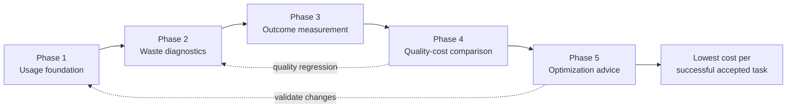

# Roadmap

TokDoctor's product goal is to help users reach an acceptable, verifiable level
of AI-assisted work quality at the lowest practical cost.

The long-term optimization target is:

```text
cost per successful, accepted task
```

Token reduction alone is not success. A change is an optimization only when it
reduces cost, latency, or waste without violating the task's quality gates.

This document is the canonical product roadmap. Architecture documents explain
how the system works; this roadmap records what TokDoctor is building next and
the evidence required to call each phase complete.

## Status Definitions

| Status | Meaning |
| --- | --- |
| `complete` | Exit criteria are implemented, tested, and reachable through a supported user workflow. |
| `active` | This is the current product focus. Some deliverables may already work. |
| `planned` | Direction is agreed, but implementation is not the current focus. |
| `future` | Useful direction that still requires product evidence or earlier phases. |

A phase is not complete merely because its types or packages exist. Its exit
criteria must be observable through the CLI, JSON output, or local Web UI and
covered by tests.

## Roadmap Overview



| Phase | Status | Product question |
| --- | --- | --- |
| 1. Usage foundation | `complete` | Where did the tokens and cost go? |
| 2. Waste diagnostics | `active` | Which observed behavior is likely wasting context, tokens, time, or money? |
| 3. Outcome measurement | `planned` | Did the task succeed, and what evidence supports that conclusion? |
| 4. Quality-cost comparison | `planned` | Is one workflow cheaper without observable quality regression? |
| 5. Optimization advice | `future` | What should the user change for this type of task? |

## Phase 1: Usage Foundation

Status: `complete`

Delivered:

- provider-reported usage for supported Codex and Claude Code sessions
- explicit measured, derived, counted, estimated, and unknown measurement kinds
- fresh, cached, output, reasoning, total, and billable usage where sources expose them
- session discovery and usage reporting
- local pricing catalog and API-equivalent cost estimates
- context attribution and coverage reporting
- gateway capture, observation matching, and reconciliation
- terminal and JSON presentation

Exit criteria:

- [x] Missing usage remains distinct from an explicit zero.
- [x] Provider-reported usage takes precedence over estimates.
- [x] Estimates are labeled as estimates.
- [x] Supported sources normalize into platform-independent models.
- [x] Cost calculation works without uploading session content.
- [x] Core usage workflows are available without the Web UI.

Maintenance work in this phase is allowed when a supported source changes its
format or when accuracy tests reveal a measurement defect. Such work does not
make usage measurement the main product focus again.

## Phase 2: Waste Diagnostics

Status: `active`

Goal: turn usage data into narrow, evidence-backed findings with actionable
recommendations.

Delivered:

- [x] `TOOL001 oversized-tool-output`
- [x] `TOOL002 repeated-tool-call`
- [x] finding severity, confidence, evidence, estimated impact, and recommendation
- [x] terminal and JSON finding output

Current hardening:

- [ ] Validate `TOOL002` against real Codex and Claude Code source shapes, including freeform custom-tool input.
- [ ] Track rule coverage so an absent finding is distinguishable from unobservable source data.
- [ ] Establish sanitized end-to-end fixtures for every enabled rule and supported source.

Planned deterministic rules:

- [ ] `TOOL003 repeated-file-read`
- [ ] `CTX001 runaway-context-growth`
- [ ] `MCP001 unused-mcp`
- [ ] `MCP002 oversized-mcp-schema`
- [ ] `INST001 oversized-instructions`
- [ ] `INST002 duplicated-instructions`

Exit criteria:

- [ ] Each enabled rule has positive, negative, edge, and source-to-finding integration tests.
- [ ] Findings never expose raw prompts, tool output, arguments, credentials, or internal hashes.
- [ ] Estimated impact is never described as provider-measured waste.
- [ ] Users can tell whether a rule found nothing or lacked the data required to evaluate the session.
- [ ] At least the tool-output, repeated-work, context-growth, and instruction/MCP waste families have one production-ready rule.
- [ ] Rules have been validated on sanitized examples of real supported-source shapes.

## Phase 3: Outcome Measurement

Status: `planned`

Goal: measure whether work succeeded using local, deterministic evidence before
using semantic or LLM-based evaluation.

Planned capabilities:

- [ ] canonical `Outcome` model with evidence and explicit unknown states
- [ ] build, test, lint, and type-check results when locally observable
- [ ] task completion, failure, cancellation, and timeout signals
- [ ] retry, rework, revert, and repeated-fix indicators
- [ ] elapsed duration and turn count
- [ ] optional user acceptance signal
- [ ] outcome coverage report

Exit criteria:

- [ ] TokDoctor can distinguish success, failure, and unknown without guessing.
- [ ] Quality signals retain their command, source, timestamp, and completeness provenance without storing sensitive output unnecessarily.
- [ ] A session can report cost and outcome together.
- [ ] Missing quality evidence prevents an equivalence claim rather than becoming a passing result.

## Phase 4: Quality-Cost Comparison

Status: `planned`

Goal: compare workflows on cost and quality evidence instead of token count
alone.

Candidate workflow:

```bash
tok compare <session-a> <session-b>
```

Planned comparison dimensions:

- [ ] total and billable token difference
- [ ] API-equivalent cost difference
- [ ] duration and turn difference
- [ ] build, test, lint, and acceptance outcomes
- [ ] retry and rework difference
- [ ] evidence coverage and comparison confidence

Exit criteria:

- [ ] TokDoctor can identify a cheaper workflow without claiming equivalent quality when evidence is missing.
- [ ] Comparisons explain which quality gates were checked and which were unavailable.
- [ ] Reports distinguish observed improvement, regression, tradeoff, and inconclusive results.
- [ ] JSON output is stable enough for local automation and experiments.

## Phase 5: Optimization Advice

Status: `future`

Goal: recommend changes supported by the user's own local history and verified
outcomes.

Candidate recommendations:

- model selection by task type
- reasoning-effort selection
- tool and command scoping
- context and compaction policy
- MCP server and schema configuration
- instruction sizing and deduplication

Exit criteria:

- [ ] Every recommendation cites observed local evidence.
- [ ] Expected savings and confidence are explicit.
- [ ] Recommendations include a quality verification plan.
- [ ] Before/after results can confirm or reject the recommendation.
- [ ] TokDoctor never silently modifies agent configuration or source sessions.

## Roadmap Update Rules

Update this document in the same change that materially changes roadmap status.

When completing an item:

1. Check the item only after implementation and relevant tests pass.
2. Add or update user-facing documentation for the supported workflow.
3. Confirm that the feature is reachable from a CLI, JSON, or local Web UI path.
4. Update phase status only when every exit criterion is satisfied.
5. Record newly discovered coverage gaps as unchecked work instead of weakening an exit criterion.

Do not duplicate detailed implementation status across multiple documents.
`README.md` should summarize current capabilities, `architecture.md` should
describe current design, and this file should own product sequence and phase
completion.
